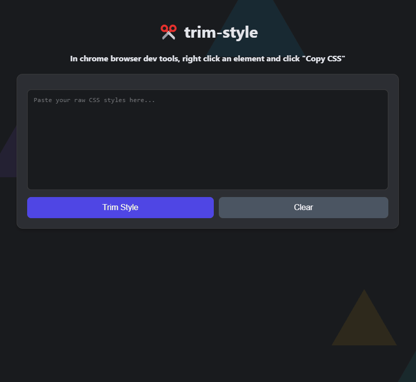

# trim-style
✂️ Simple web app for extracting only the essential styles from raw style properties

## About
A lightweight tool that helps you clean and format CSS properties copied from browser dev tools. Simply right-click an element in Chrome's dev tools, select "Copy CSS", and paste it here to get clean, formatted CSS properties.

## Features
- Removes unnecessary class wrappers
- Formats CSS properties consistently
- Handles CSS variables
- Preserves hex colors and complex values
- Beautiful floating triangles animation in the background
- One-click copy to clipboard
- Instant page reload to clear input

## Usage
1. Open Chrome dev tools (F12)
2. Right-click any element
3. Click "Copy CSS"
4. Paste into trim-style
5. Get clean CSS properties!

